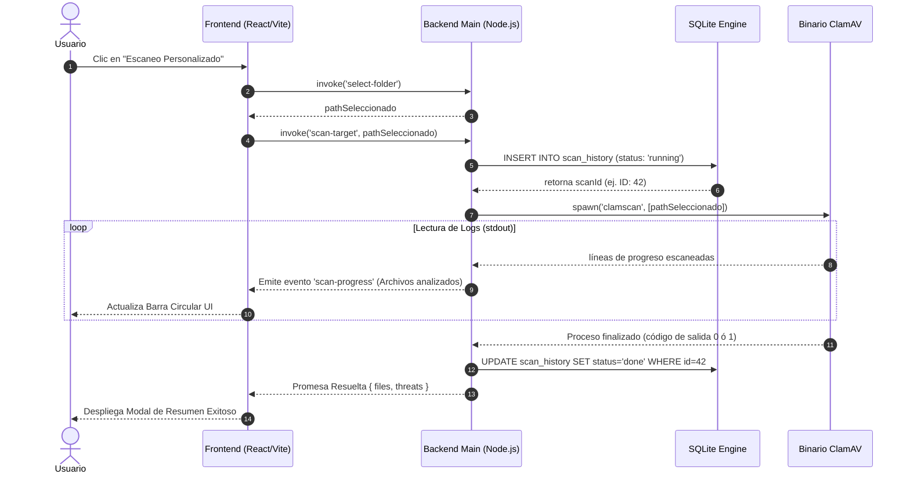
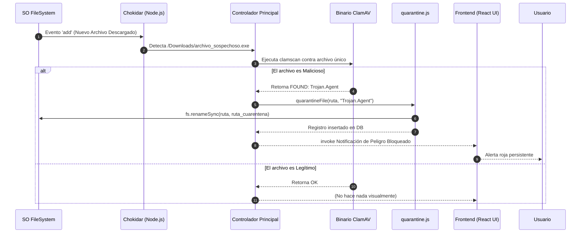
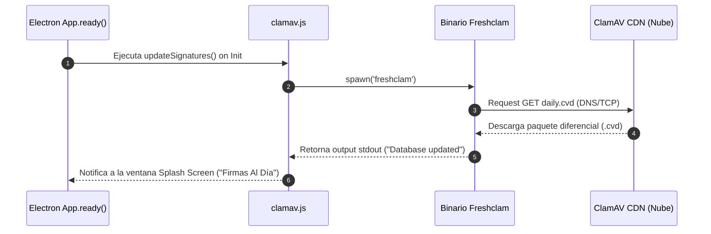

**UNIVERSIDAD PRIVADA DE TACNA**

**FACULTAD DE INGENIERIA**

**Escuela Profesional de Ingeniería de Sistemas**

**Proyecto de Antivirus**

Curso: *Calidad y Pruebas de Software*

Docente: *Mag. Patrick Cuadros Quiroga*

Integrantes:

***LLica Mamani, Jimmy Mijair (2023076789)***

***Sierra Ruiz, Iker Alberto (2023077090)***

**Tacna – Perú**

***2026***

Sistema *RustGuard Antivirus*

Informe de Requerimientos y Pruebas

Versión *1.0*

| CONTROL DE VERSIONES | | | | |
|:---:|:---|:---|:---|:---|
| Versión | Hecha por | Revisada por | Aprobada por | Fecha | Motivo |
| 1.0 | LLica Mamani, Jimmy Mijair | Sierra Ruiz, Iker Alberto | LLica Mamani, Jimmy Mijair | 02/06/2026 | Versión Extendida |

# **INDICE GENERAL**

[1. User Stories (Formato Como... Quiero... Para...)](#1-user-stories-formato-como-quiero-para)

[2. Criterios de Aceptación (Gherkin DADO... CUANDO... ENTONCES...)](#2-criterios-de-aceptación-gherkin-dado-cuando-entonces)

[3. Diagramas de Secuencia Avanzados](#3-diagramas-de-secuencia-avanzados)

&nbsp;&nbsp;[3.1 Secuencia de un Escaneo Interactivo](#31-secuencia-de-un-escaneo-interactivo)

&nbsp;&nbsp;[3.2 Secuencia de Monitoreo Activo (Watcher) y Cuarentena Automática](#32-secuencia-de-monitoreo-activo-watcher-y-cuarentena-automática)

&nbsp;&nbsp;[3.3 Secuencia de Actualización de Firmas (Freshclam)](#33-secuencia-de-actualización-de-firmas-freshclam)

**<u>Informe de Requerimientos</u>**

## 1. User Stories (Formato Como... Quiero... Para...)

**Historia de Usuario 1: Escaneo Rápido**
- **COMO** usuario general de RustGuard
- **QUIERO** disponer de un botón de "Escaneo Rápido" en el panel de control principal
- **PARA** verificar la integridad de los directorios críticos de mi equipo (Descargas, Temp, Escritorio) en pocos minutos y asegurar que no haya amenazas inminentes activas.

**Historia de Usuario 2: Escaneo Personalizado por Carpeta**
- **COMO** usuario que acaba de insertar un pendrive USB o disco externo
- **QUIERO** poder seleccionar una ruta específica del sistema a través de un cuadro de diálogo del explorador
- **PARA** forzar un análisis de malware focalizado única y exclusivamente en dicho dispositivo extraíble.

**Historia de Usuario 3: Cuarentena y Aislamiento Preventivo**
- **COMO** administrador preocupado por la integridad del sistema
- **QUIERO** que cualquier ejecutable o script malicioso detectado por ClamAV sea movido automáticamente a un directorio seguro (Cuarentena)
- **PARA** evitar su ejecución por accidente, pero sin borrarlo definitivamente de mi disco duro.

**Historia de Usuario 4: Restauración de Falsos Positivos**
- **COMO** desarrollador o analista de software
- **QUIERO** contar con una tabla visual dentro de la aplicación que liste los archivos en cuarentena y ofrezca un botón "Restaurar"
- **PARA** devolver un archivo legítimo (falso positivo) a su ruta original para seguir utilizándolo sin problemas.

**Historia de Usuario 5: Auditoría e Historial**
- **COMO** encargado de soporte técnico
- **QUIERO** visualizar un registro tabular histórico de todos los escaneos ejecutados previamente
- **PARA** auditar qué tipos de análisis se corrieron, cuánto demoraron y cuántas amenazas totales se hallaron.

**Historia de Usuario 6: Protección Silenciosa en Tiempo Real**
- **COMO** usuario sin experiencia técnica
- **QUIERO** poder activar un interruptor (toggle) de "Protección en tiempo real"
- **PARA** que RustGuard se encargue de monitorear archivos creados o descargados en segundo plano, notificándome visualmente si se detecta un peligro.

---

## 2. Criterios de Aceptación (Gherkin DADO... CUANDO... ENTONCES...)

A continuación se plantean los escenarios de prueba BDD (Behavior-Driven Development) necesarios para asegurar la calidad de la lógica de la aplicación.

### Escenario 1: Ejecución y Registro de un Escaneo Exitoso
**DADO** que la base de datos de firmas de ClamAV está funcional e indexada
**Y** el usuario se encuentra en la vista principal (Home)
**CUANDO** el usuario hace clic en el botón "Iniciar Escaneo Completo"
**ENTONCES** el frontend (React) debe inhabilitar los demás botones de escaneo para evitar conflictos
**Y** el backend (Node.js) debe crear un registro en la tabla `scan_history` con estado "running"
**Y** al concluir el proceso, el registro debe ser actualizado con la cantidad exacta de archivos escaneados y marcando su estado como "done".

### Escenario 2: Intercepción de una amenaza y Envío a Cuarentena
**DADO** que se está realizando un análisis sobre una carpeta que contiene el archivo de prueba EICAR (Malware genérico inofensivo)
**CUANDO** el proceso hijo de `clamscan` emite el mensaje por consola *"Eicar-Test-Signature FOUND"*
**ENTONCES** el módulo `quarantine.js` debe tomar la ruta de dicho archivo
**Y** el archivo debe ser movido instantáneamente a la ruta de cuarentena `.rustguard_quarantine`
**Y** se debe insertar un registro en la tabla `quarantine` de SQLite detallando la ruta original, la fecha y el nombre de la amenaza.

### Escenario 3: Restauración exitosa de un archivo en Cuarentena
**DADO** que el usuario seleccionó la pestaña "Cuarentena"
**Y** existe al menos un registro en estado "No Restaurado"
**CUANDO** el usuario hace clic en la acción "Restaurar" asociada a dicho archivo
**ENTONCES** el archivo físico debe ser retornado desde la carpeta `.rustguard_quarantine` hacia su ruta original en el disco
**Y** el campo booleano `restored` del registro correspondiente en SQLite debe ser actualizado a `true` o `1`.

### Escenario 4: Interfaz de Exportación de Reportes
**DADO** que existen más de 3 registros históricos en la tabla `scan_history`
**CUANDO** el usuario presiona "Exportar Historial"
**ENTONCES** Electron debe levantar un modal nativo `dialog.showSaveDialog` del sistema operativo
**Y** una vez que el usuario confirma el guardado, debe generarse un archivo de texto plano (`.txt`) estructurado y formateado con las fechas, duraciones y conteos de amenazas.

### Escenario 5: Activación de Monitoreo en Tiempo Real (Watcher)
**DADO** que el servicio de Watcher se encuentra apagado
**CUANDO** el usuario activa el *Toggle* de "Protección en Tiempo Real"
**ENTONCES** Node.js debe instanciar la clase `chokidar` apuntando al directorio de *Downloads* del usuario
**Y** al copiar un archivo nuevo en *Downloads*, el Watcher debe invocar silenciosamente `clamscan` para dicho archivo único, reportando un log de éxito o amenaza según corresponda.

---

## 3. Diagramas de Secuencia Avanzados

Los siguientes diagramas detallan la comunicación (IPC - Inter Process Communication) necesaria entre los componentes de React, Node.js y SQLite.

### 3.1 Secuencia de un Escaneo Interactivo

Este diagrama documenta la trazabilidad completa, desde que el usuario solicita un escaneo, pasando por el guardado en la DB, hasta la emisión de resultados.

### 3.2 Secuencia de Monitoreo Activo (Watcher) y Cuarentena Automática

Este flujo documenta la interacción de fondo. Ocurre sin intervención del usuario luego de que el "Watcher" está activo.

### 3.3 Secuencia de Actualización de Firmas (Freshclam)

RustGuard debe mantener su inteligencia artificial actualizada; esto sucede al arrancar la aplicación o mediante configuración manual.

