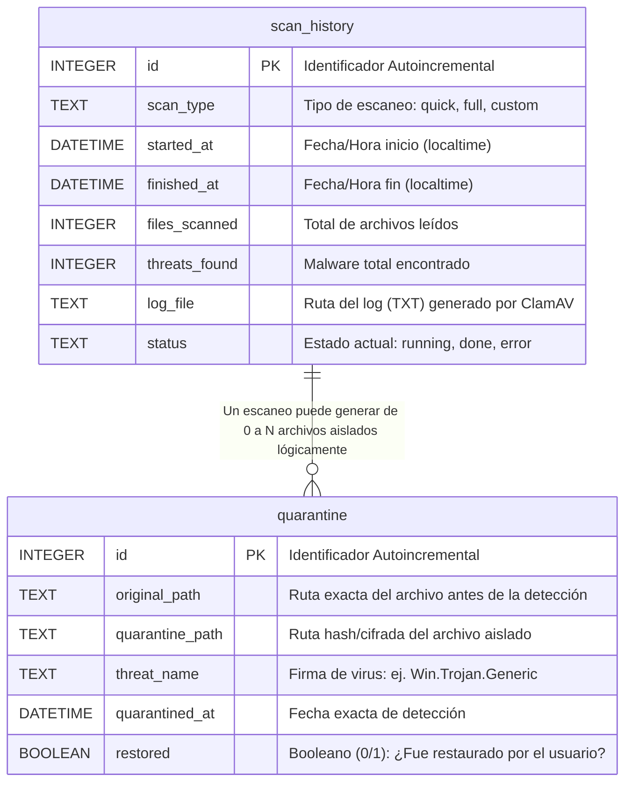
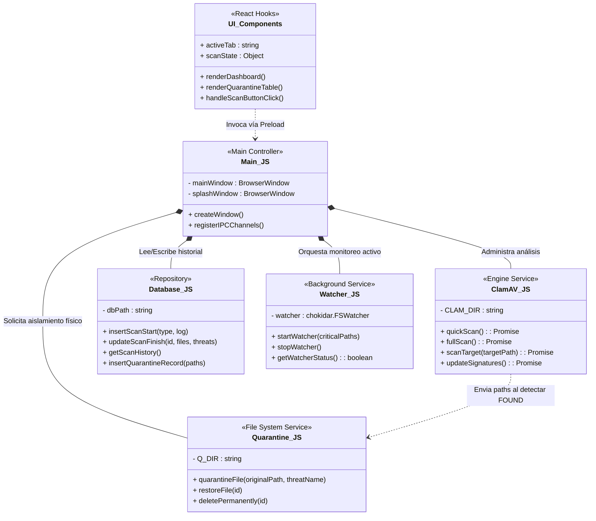
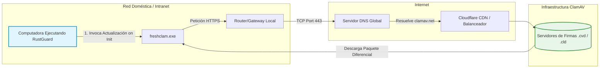

<center>


**UNIVERSIDAD PRIVADA DE TACNA**

**FACULTAD DE INGENIERIA**

**Escuela Profesional de Ingeniería de Sistemas**

**Proyecto de Antivirus**

Curso: *Calidad y Pruebas de Software*

Docente: *Mag. Patrick Cuadros Quiroga*

Integrantes:

***LLica Mamani, Jimmy Mijair (2023076789)***

***Sierra Ruiz, Iker Alberto (2023077090)***

**Tacna – Perú**

***2026***

</center>

<div style="page-break-after: always; visibility: hidden"></div>

Sistema *RustGuard Antivirus*

Informe de Arquitectura

Versión *1.0*

| CONTROL DE VERSIONES | | | | |
|:---:|:---|:---|:---|:---|
| Versión | Hecha por | Revisada por | Aprobada por | Fecha | Motivo |
| 1.0 | LLica Mamani, Jimmy Mijair | Sierra Ruiz, Iker Alberto | LLica Mamani, Jimmy Mijair | 02/06/2026 | Versión Extendida |

<div style="page-break-after: always; visibility: hidden"></div>

# **INDICE GENERAL**

[1. Introducción a la Ingeniería Inversa](#1-introducción-a-la-ingeniería-inversa)

[2. Diagrama de Arquitectura Lógica](#2-diagrama-de-arquitectura-lógica)

[3. Diagrama Entidad-Relación (Base de Datos)](#3-diagrama-entidad-relación-base-de-datos)

[4. Diagrama de Clases Estructurales](#4-diagrama-de-clases-estructurales)

[5. Diagrama de Componentes Modular](#5-diagrama-de-componentes-modular)

[6. Diagrama de Despliegue Físico](#6-diagrama-de-despliegue-físico)

[7. Diagrama de Infraestructura de Red](#7-diagrama-de-infraestructura-de-red)

<div style="page-break-after: always; visibility: hidden"></div>

**<u>Informe de Arquitectura</u>**

## 1. Introducción a la Ingeniería Inversa
El presente informe documenta el estado y la estructura real de la arquitectura del sistema **RustGuard Antivirus**, obtenidos mediante procesos de ingeniería inversa aplicados directamente sobre el repositorio fuente (stack React + Vite + Node.js + Electron). 
Al tratarse de una aplicación Electron, el sistema acata estrictamente el modelo multi-proceso de Chromium: dividiendo el código en un *Proceso Principal* (Main Process, con acceso pleno al SO) y un *Proceso Renderizador* (Renderer Process, aislado y seguro que gestiona la UI). Toda comunicación transcurre en túneles IPC (Inter-Process Communication) controlados por un script intermedio o *Preload*.

## 2. Diagrama de Arquitectura Lógica

Este esquema macro muestra cómo RustGuard orquesta su carga de trabajo. La seguridad estructural se basa en aislar la capa visual construida con React (que no puede borrar ni acceder al disco duro por sí sola) de los módulos Node.js que tienen permisos de manipulación sobre ClamAV y el File System.


*Descripción:* El `Frontend` envía mensajes (ej. `invoke('scan-quick')`) al `Preload`. El `Preload` valida y transfiere el mensaje al `MainController`. El `MainController` entonces orquesta a `SQLite` para registrar el evento y acciona a `ClamAVCore` a nivel del disco duro para escanear, retornando el resultado por la misma vía inversa.

## 3. Diagrama Entidad-Relación (Base de Datos)

Para sostener la trazabilidad exigida por las rubricas de calidad, RustGuard usa una base de datos local robusta: `better-sqlite3`. Esta opera sobre un único archivo `.db` en modo WAL (Write-Ahead Logging) para soportar escrituras concurrentes sin bloquear lecturas de la UI.



## 4. Diagrama de Clases Estructurales

Puesto que Javascript es multiparadigma, la ingeniería inversa interpreta los módulos independientes (archivos `.js`) como Clases funcionales, demostrando la alta cohesión y bajo acoplamiento del backend de RustGuard.



## 5. Diagrama de Componentes Modular

La empaquetación de los módulos es crítica para el compilado final con `vite build` y `electron-builder`. Este diagrama ilustra las dependencias internas y bibliotecas de terceros que conforman RustGuard.

```mermaid
componentDiagram
    package "RustGuard Electron Bundle" {
        package "Capa Presentación (Frontend)" {
            [React 19] <<UI Library>>
            [Tailwind CSS 4] <<Styling Engine>>
            [Lucide Icons] <<Iconography>>
        }
        
        [preload.cjs] <<Context Bridge>>

        package "Capa Dominio (Backend Local)" {
            [Node.js Events] <<Main Logic>>
            [chokidar] <<File Watcher Lib>>
            [better-sqlite3] <<SQLite Driver>>
        }
    }

    package "Entorno del Sistema (Local OS)" {
        [rustguard.db] <<Base de Datos SQLite>>
        [.rustguard_quarantine] <<Directorio Seguro>>
        [ClamAV / Freshclam] <<Binarios C++>>
    }

    [Capa Presentación (Frontend)] --> [preload.cjs] : Invoca APIs de RustGuard
    [preload.cjs] --> [Node.js Events] : Delega permisos strictos
    [Node.js Events] --> [better-sqlite3]
    [Node.js Events] --> [chokidar]
    
    [better-sqlite3] --> [rustguard.db] : Transacciones ACID
    [chokidar] --> [Entorno del Sistema (Local OS)] : Escucha FSEvents de Windows/Linux
    [Node.js Events] --> [ClamAV / Freshclam] : Spawn (procesos hijos)
```

## 6. Diagrama de Despliegue Físico

El despliegue físico de la aplicación detalla cómo los componentes lógicos se sitúan en el hardware real del usuario cuando se ejecuta el `.exe` final. Demuestra que no existen servidores backend obligatorios para operar el escaneo, proporcionando total autonomía *offline*.

```mermaid
graph TD
    subgraph Computadora Local del Usuario (PC/Laptop)
        subgraph Sistema Operativo [Capa de OS (Windows/Linux/Mac)]
            
            subgraph Aplicación Empaquetada [RustGuard.exe / RustGuard.AppImage]
                Renderer[Cromium Browser Window<br/>Renderiza HTML/React]
                Main[Node.js Engine<br/>Procesa Lógica /db.js /clamav.js]
                Preload((Preload.js<br/>Seguridad IPC))
                
                Renderer <-->|Mensajes asíncronos IPC| Preload
                Preload <-->|Bindings| Main
            end
            
            FS[Directorio de Usuario <br/> Documentos/Descargas/Escritorio]
            QuarantineDir[Carpeta Oculta de Cuarentena <br/> AppData/RustGuard]
            ClamBinaries[Archivos Ejecutables Externos <br/> clamscan.exe / freshclam.exe]
            SQLiteFile[(rustguard.db <br/> SQLite File)]
        end
    end

    Main -- Consulta/Escribe --> SQLiteFile
    Main -- Ejecuta comandos --> ClamBinaries
    Main -- fs.watch/chokidar --> FS
    Main -- Mueve archivos infectados --> QuarantineDir
    ClamBinaries -- Realiza Lecturas Binarias --> FS
```

## 7. Diagrama de Infraestructura de Red

Dado que la naturaleza de este antivirus exige máxima privacidad, el 99% de su carga de trabajo pertenece a la "PC Local". La única conexión externa es el actualizador `freshclam` de Cisco. Este esquema modela esa única ventana hacia Internet.


